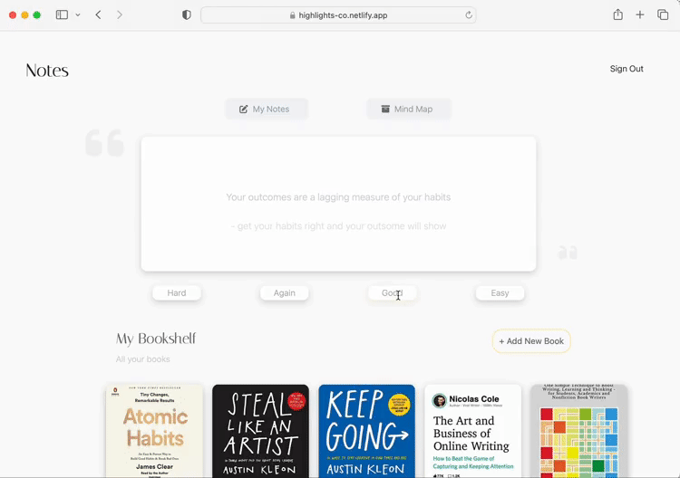

[](https://highlights-co.netlify.app/)

[
<kbd>
🗒️ Project Link
</kbd>](https://highlights-co.netlify.app/)

# 📚 Want to Remember everything you read?

Sometimes we highlight something in a book.

We found it life-changing and we highlight it.

But the thing is,
even though we found it life-changing we still manage to forget it.

In this project, I created an anki like app that
helps you remember everything that you have read

## 👩‍💻 How It's Made:

**Tech used:** HTML, CSS, JavaScript, JWT, React

FrontEnd - Used React and Tailwind to help create the UI components

BackEnd - Used Mongoose Atlas for the backend database

## 🏸 Optimizations

Things I would like to fix/add

- Create an email function -> send you a list of quotes for you to see on your email, instead of reviewing the quote here
- Ability to import the quotes from your Kindle
- Could be used to study your notes
- Still need to perfect Anki function

## 📝 Lessons Learned:

This project taught me a few important lessons. Learning about how a language works and the importance of documentation is very important when creating a project. It was my first time using React and I learned that in order for the app to be less buggy I have to build according to the document or else it won't work as I wanted.

This was shown when I just wanted to toggle the Heart Component. Although the code was correct ( I believe) the Heart still wasn't toggle right. It was not until I understood that because of the order of my functions, React was rerendering even when it was not ready to be re-rendered

## 👩‍💻 To try the project

Frontend
in .env file

```
REACT_APP_SERVER_URL = "link to backend/ your localhost"
```

Backend

```
ATLAS_URI = "your MongoDB string"
JWT_SECRET= "any passphrase"
PASS_SECRET = "any passphrase"
SALT= "any number"
npm install
npm start
```
